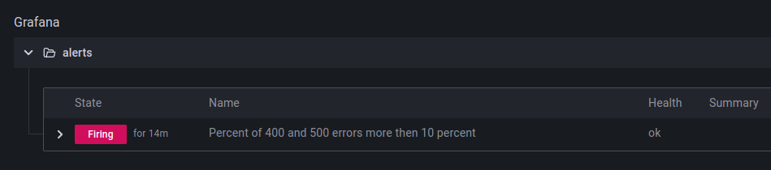

# Монторинг приложения в kubernetes
* Создаем кластер в GCP
* Устанавливаем ingress контроллер
 `helm install nginx-ingress ingress-nginx/ingress-nginx --create-namespace --namespace ingress-nginx`
 * Устанвливаем istio
 * Устанавливаем аддоны для istio: prometeus, grafana
 * Собираем docker образ (app/Dockerfile) и деплоим манифесты (kuber/*) в кубер
 * Настраиваем дашборд и алерт в grafana
 * Для создания нагрузки можно использовать команду `while true; do for i in {1..10}; do curl -s http://35.223.169.232/500  &  done; sleep 1; done` которая будет отправлять 10 запросов в секунду и получать 500 код ответа.

 Пример дашборда показывающего статистику http ответов:
 

 Пример сработавшего алерта:
 

 ### #TODO
 * Разработать разворачивание кубера на terraform
 * Автоматизировать разворачивание сервисов в кубер
 * Настроить мониторинг средствами обака (Metrics Explorer в GCP)